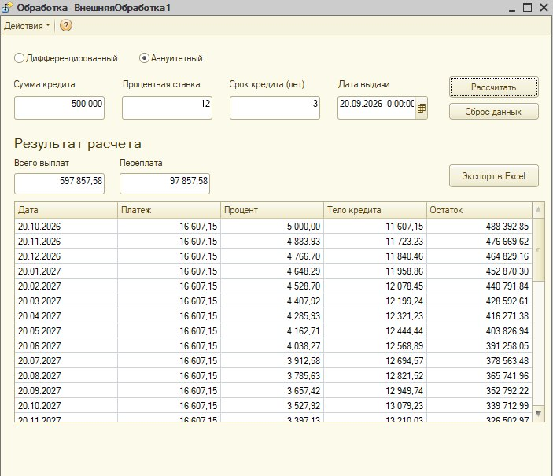
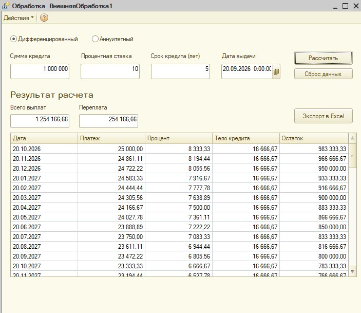

# Кредитный калькулятор на 1С

Учебный проект, разработанный в процессе изучения разработки на платформе 1С:Предприятие.
Калькулятор позволяет рассчитать график платежей по кредиту с аннуитетным или дифференцированным способом погашения.

## Возможности
- расчет аннуитетного кредита;
- расчет дифференцированного кредита;
- формирование графика платежей;
- расчет процентов;
- расчет погашения тела кредита;
- расчет остатка задолженности;
- расчет общей суммы выплат;
- расчет переплаты;
- выбор даты выдачи кредита;
- проверка введенных пользователем данных;
- подготовка графика платежей к экспорту в Excel;
- сброс введенных данных и результатов расчета.

## Входные данные
Пользователь указывает:
- сумму кредита;
- процентную ставку;
- срок кредита;
- дату выдачи;
- способ погашения.

## Результат расчета
После нажатия кнопки «Рассчитать» программа показывает:
- общую сумму выплат;
- переплату;
- дату каждого платежа;
- размер платежа;
- начисленные проценты;
- сумму погашения тела кредита;
- остаток задолженности.

## Использованные возможности 1С
В проекте использованы:
- внешняя обработка;
- обычная форма;
- реквизиты формы и объекта;
- ТаблицаЗначений;
- условные конструкции `Если`;
- циклы `Для` и `Для Каждого`;
- работа с датами;
- обработчики кнопок;
- ДиалогВыбораФайла;
- ТабличныйДокумент;
- обработка исключений `Попытка...Исключение`.

## Скриншоты
### Аннуитетный расчет

### Дифференцированный расчет

## Экспорт в Excel
Реализовано формирование `ТабличногоДокумента` на основе рассчитанного графика платежей и сохранение в формате XLSX.
Проект разрабатывался в учебной версии 1С:Предприятие. В учебной лицензии сохранение табличного документа в XLSX ограничено платформой, поэтому формирование документа проверено непосредственно в 1С, а сохранение файла требует полной версии платформы.

## Что я изучила в процессе проекта
Во время разработки я разобралась с:
- различием между элементами формы и реквизитами;
- привязкой элементов формы к данным;
- построением алгоритма программы;
- использованием условий;
- использованием циклов;
- работой с таблицами значений;
- последовательным расчетом данных внутри цикла;
- работой с датами;
- формированием табличного документа;
- обработкой ошибок.

## Статус
Проект завершен как учебная работа для портфолио начинающего 1С-разработчика.
